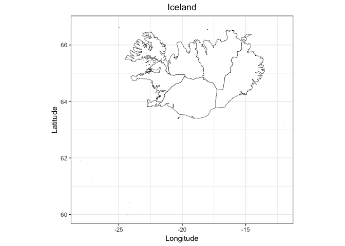
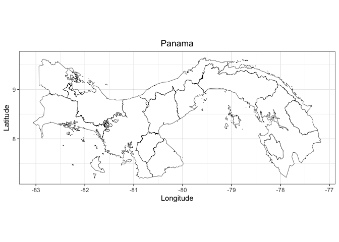
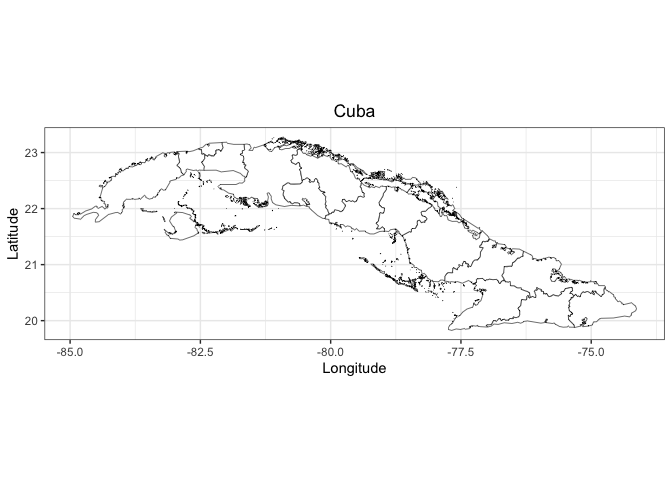

## Link
[https://github.com/lydiaPenglish/smoothMap](https://github.com/lydiaPenglish/smoothMap)

## Team Members
- Lydia English
- Yang Qiao
- Xiyuan Sun


## Description
The goal of `smoothMap` is to generate a function to help map files.

## Installation
You can install the released version of `smoothMap` from [Github](https://github.com/lydiaPenglish/smoothMap) with:

```r
devtools::install_github("lydiaPenglish/smoothMap")
```

```
## BH         (1.66.0-1 -> 1.69.0-1) [CRAN]
## checkmate  (1.8.5    -> 1.9.1   ) [CRAN]
## cli        (1.0.1    -> 1.1.0   ) [CRAN]
## colorspace (1.3-2    -> 1.4-1   ) [CRAN]
## e1071      (1.7-0    -> 1.7-1   ) [CRAN]
## lazyeval   (0.2.1    -> 0.2.2   ) [CRAN]
## maptools   (0.9-2    -> 0.9-5   ) [CRAN]
## tibble     (2.0.1    -> 2.1.1   ) [CRAN]
## tidyr      (0.8.1    -> 0.8.3   ) [CRAN]
## 
##   There are binary versions available but the source versions are
##   later:
##             binary source needs_compilation
## cli          1.0.1  1.1.0             FALSE
## colorspace   1.4-0  1.4-1              TRUE
## e1071      1.7-0.1  1.7-1              TRUE
## 
## 
## The downloaded binary packages are in
## 	/var/folders/kb/qcrc73nx3wn7b4lrrv1hcymw0000gn/T//Rtmp1o8HH8/downloaded_packages
##   
✔  checking for file ‘/private/var/folders/kb/qcrc73nx3wn7b4lrrv1hcymw0000gn/T/Rtmp1o8HH8/remotes17d317390aeae/lydiaPenglish-smoothMap-3b2d51e/DESCRIPTION’ (556ms)
## 
  
─  preparing ‘smoothMap’:
##    checking DESCRIPTION meta-information ...
  
✔  checking DESCRIPTION meta-information
## 
  
   Warning in as.POSIXlt.POSIXct(x, tz) :
##      unknown timezone 'zone/tz/2018i.1.0/zoneinfo/America/Chicago'
## 
  
─  checking for LF line-endings in source and make files
## 
  
─  checking for empty or unneeded directories
## ─  building ‘smoothMap_0.1.0.tar.gz’
## 
  
   
## 
```

## Example
This is a basic example which shows you how to use the functions in `smoothMap`:


```r
library(smoothMap)
library(ggplot2)

isl_file <- system.file("extdata", "gadm36_ISL_1.shp", package = "smoothMap")
isl_data <- team_1(isl_file, tolerance = 0.01)
ggplot(isl_data, aes(x = long, y = lat, group = group)) +
  geom_polygon(color = "black", fill = "white", size = 0.2) +
  labs(x = "Longitude", y = "Latitude", title = "Iceland") +
  coord_quickmap() +
  theme_bw() +
  theme(plot.title = element_text(hjust = 0.5))
```



```r
pan_file <- system.file("extdata", "gadm36_PAN_1.shp", package = "smoothMap")
pan_data <- team_4(pan_file, tolerance = 0.01)
ggplot(pan_data, aes(x = long, y = lat, group = group)) +
  geom_polygon(color = "black", fill = "white", size = 0.2) +
  labs(x = "Longitude", y = "Latitude", title = "Panama") +
  coord_quickmap() +
  theme_bw() +
  theme(plot.title = element_text(hjust = 0.5))
```



```r
cub_file <- system.file("extdata", "gadm36_CUB_1.shp", package = "smoothMap")
cub_data <- team_2(cub_file, tolerance = 0.01)
ggplot(cub_data, aes(x = long, y = lat, group = group)) +
  geom_polygon(color = "black", fill = "white", size = 0.2) +
  labs(x = "Longitude", y = "Latitude", title = "Cuba") +
  coord_quickmap() +
  theme_bw() +
  theme(plot.title = element_text(hjust = 0.5))
```


